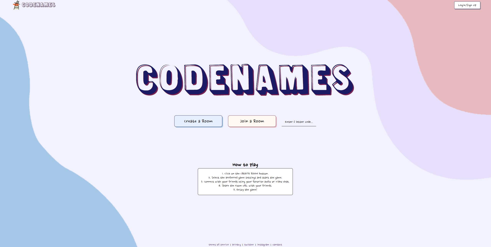
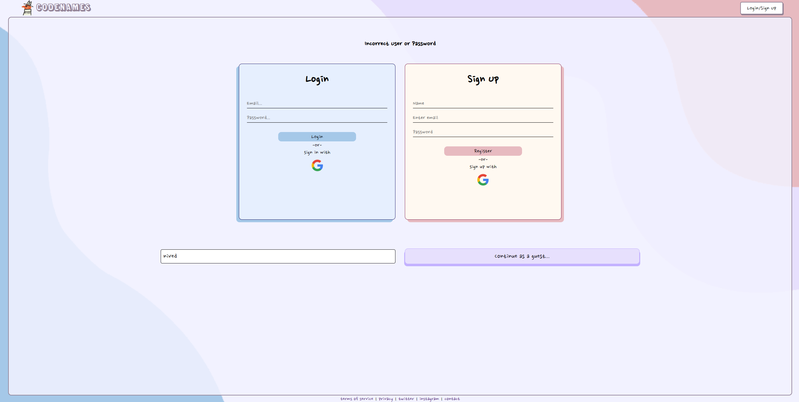
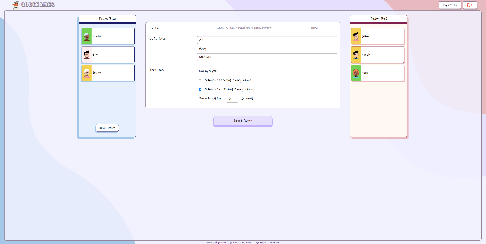
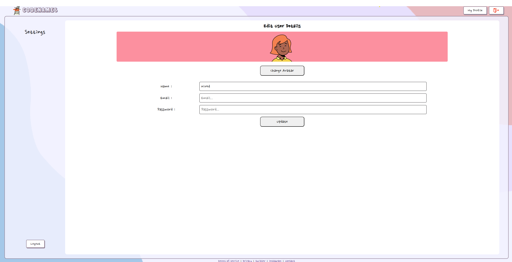
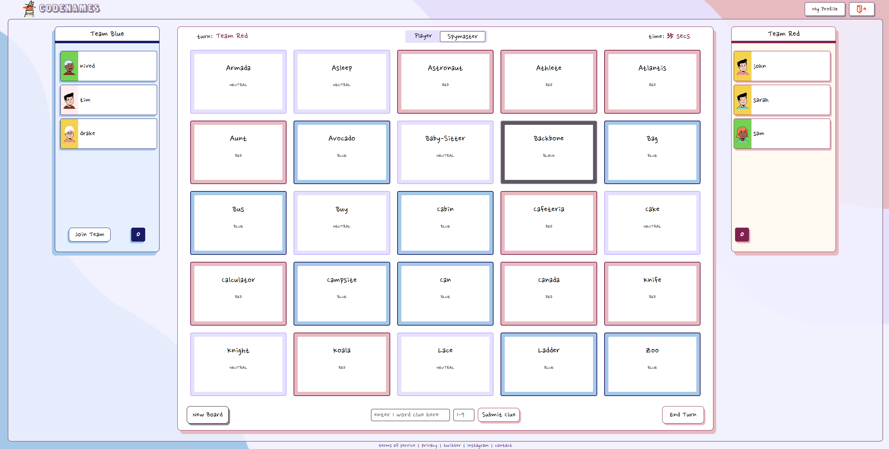
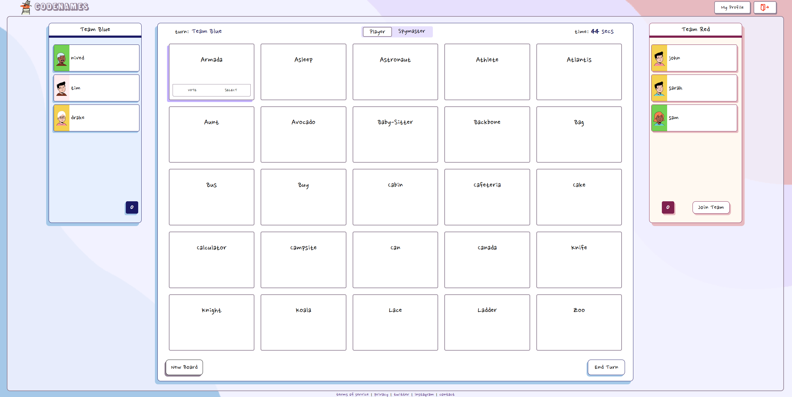

A browser based game inspired from the Codenames board game using websockets and MERN stack. This is a word-based party game where two teams compete to uncover their words on a grid of word cards. Teammates receive one-word clues from their spymaster to guess the right cards, avoiding opponent's agents and the assassin. The first team to identify all their agents or find the opponent's assassin wins.

#

### Language & Tools

  

### Overview
- The frontend is developed using the React Framework. While hosting, the frontend is served using Nginx as per the config file located at `/client/nginx/nginx.conf`.
- The backend server is created using Node.js and Express. 
- User data and list of words to be used in the game is stored as a MongoDB collection.
- Data related to a specific instance of a game is stored on the backend. For each instance of a game a websocket connection is established using the Socket.io library. A room is created for each game session and users then connect to a game using a unique room id generated. The url for a game is dynamically generated based on the room id. 

#### Testing & Deployment
Two worflows have been created using GitHub actions, one for testing and the other for deployment.
- Testing Worflow: This worflow runs the client side and server side test scripts written in Jest.
- Deployment Worflow: If the tests run have passed, client side and server side docker images are generated and pushed into dockerhub and Google Container Registry. The image is then deployed to Google Cloud services. (Currently disabled)

Alternatively, Docker Compose files included in the repo can be run separately to generate images that can be run on localhost.

#### Screenshots

